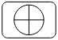

# DIU20
Prácticas Diseño Interfaces de Usuario 2019-20 (Economía Colaborativa)

Grupo: DIU3.Learning.  Curso: 2019/20

Proyecto:Incontro.

Descripción:Incontro es una una aplicación móvil a desarrollar que permite la organización de actividades en grupo que promueven la utilización de lenguas extranjeras. La plataforma pondrá en contacto a las diferentes partes: Usuarios, profesionales y establecimientos, para una mayor facilidad de organización.Los usuarios tendrán la ventaja de poder realizar estas actividades a costo compartido.Los profesionales podrán obtener beneficio de impartir un trabajo en estás actividades.Los establecimientos podrán ofrecer a cambio de unos beneficios, consumo o lo que vea conveniente, sus establecimientos para la realización de la actividad.

Las ideas vamos a diseñar:

    -Es que queremos que los grupos prevalezcan en el tiempo ya que queremos crear vínculos entre los integrantes.

    -Un calendario en el que podamos ver de forma mas visual las actividades inscritos.

    -Implementación de bonos o promociones para los usuarios.

    -Un modo premium que te libre de ciertos pagos y acceso a contenido exclusivo.

    -Un monedero para llevar un control de tus gastos.

    -Un modo oscuro.

Logotipo:

Miembros
 * :bust_in_silhouette:   https://github.com/salva12345678/DIU     :octocat:     
 * :bust_in_silhouette:   https://github.com/IgnacioMorillas/DIU_2019-2020     :octocat:   
-----

En esta práctica estudiaremos un caso de plataforma de economía colaborativa y realizaremos una propuesta para su diseño Web/movil. Utilizaremos herramientas y entregables descritos en el siguiente CheckList (https://github.com/mgea/UX-DIU-Checklist)

Qué es economia colaborativa: Martínez-Polo, J. (2019). **El fenómeno del consumo colaborativo: del intercambio de bienes y servicios a la economía de las plataformas**, *Sphera Publica, 1*(19), 24-46. http://sphera.ucam.edu/index.php/sphera-01/article/view/363/14141434

# Proceso de Diseño

## Paso 1. UX Desk Research & Analisis

 1.a Competitive Analysis
-----

>>> Entre las aplicaciones y páginas web que hemos visto las que más se adaptan mejor a una experiencia de ocio son [Meetup-Language](https://www.meetup.com/es-ES/find/language/) y [Hi uTandem](https://www.facebook.com/Hiutandemapp/).Entre estas dos se ha elegido [Meetup-Language](https://www.meetup.com/es-ES/find/language/) dado que está disponible en Android y no muestra problemas "graves".

Para más información sobre las otras plataformas  en el Análisis de la Competencia [pulse aquí](https://github.com/salva12345678/DIU/tree/master/P1)

 1.b Persona
-----

>>>En primer lugar hemos creado a [Manuel](https://github.com/salva12345678/DIU/tree/master/P1),Una persona con amplias capacidades pero con poca iniciativa en el mundo de las redes sociales y en este sentido Manuel se plantea como un colectivo de la plataforma pues uno de sus retos ya sea por trabajo u ocio le hacen usar esta aplicación.

>>>Por último, también hemos creado a [Noelia](https://github.com/salva12345678/DIU/tree/master/P1), Es cual es una persona bastante tímida, y que además no está iniciada en el mundo de estas nuevas plataformas por lo tanto le es difícil hacer esta tarea además de que sus circunstancias familiares no la da mucho margen de tiempo libre.

 1.c User Journey Map
----

>>> [El problema de Manuel con el ingles](https://github.com/salva12345678/DIU/tree/master/P1).Aquí se nos presenta el problema de la dificultad de cambiar de idioma.

>>> [Encuentro por sorpresa de Noelia con su ex](https://github.com/salva12345678/DIU/tree/master/P1).Aquí se nos presenta el problema de tener tu cuenta en modo público.

 1.d Usability Review
----

>>> - Enlace al documento:
      Para ver el PDF [pulse aquí](https://github.com/salva12345678/DIU/blob/master/P1/Usability-review.pdf)

>>> - Valoración final de Meetup:64
>>> - Comentario sobre la valoración:En general la web cumple con las principales características y metas que se persiguen.La información que se muestra es precisa y no es redundante.Los resultados de las búsquedas son relevante y precisas.El rendimiento de la página es excelente.Existen otros aspectos que no han sido muy gratificantes.Las funciones de volver atrás fallaban y te llevaba a una pantalla en blanco.En la página hay marcadores que están descuadrados.La ubicación actual no está clara .La búsqueda por parámetros múltiples es bastante pobre.No hay búsquedas comunes sino que ya están definidas.Los usuarios no pueden enviar comentario,no hay correo de la empresa y solo hay un chat de ayuda.

Para más información [pulse aquí](https://github.com/salva12345678/DIU/tree/master/P1)

## Paso 2.Incontro UX Design

 2.a Feedback Capture Grid
----

En la malla receptora de información que hemos recopilado teniendo en cuenta las buenas características de la web que analizamos en la practica 1,las dificultades que encontraron nuestros usuarios que gracias a ese punto de vista vimos que podían mejorarse y algunas sugerencias para implementar nuevas funcionalidades,llevar a cabo una crítica constructiva centrándonos en los errores críticos que hemos analizado e ideas aportadas por los desarrolladores donde se corregirían funcionalidades y aportar propuestas de valor como es el sistema de bonificación por la asistencia de los eventos en el ámbito de los idiomas ademas de buscar una simbiosis entre los tres protagonistas principales como el usuario,el profesional y el establecimiento para que se beneficien y cooperen.    

Para ver la malla receptora de información [pulse aquí](https://github.com/salva12345678/DIU/tree/master/P2)

 2.b Tasks & Sitemap
-----

Entre las dos posibilidades nos hemos decidido por por hacer la matriz de tareas para analizar los usuarios que van a usar la aplicación y las tareas principales para poder analizar la frecuencia de uso de las acciones y así poder situar las funcionalidades en la aplicación. Para todo esto se hará un ranking de estas funcionalidades pero también viendo otros aspectos ya que habrá algunas funcionalidades que solo usará uno de los tantos tipos de usuarios que hay.

Para ver la matriz de usuario y tareas [pulse aquí](https://github.com/salva12345678/DIU/tree/master/P2)

 2.c Labelling
----

Para una mayor comodidad se ha creado una jerarquía principal para tener una vista principal y  luego poder analizar cada sector por separado.

Para ver los diagramas y su correspondiente explicación [pulse aquí](https://github.com/salva12345678/DIU/tree/master/P2)

 2.d Wireframes
-----

Para esta parte hemos desarrollado una serie de bocetos sobre las distintas partes de la interfaz.Para tener una mayor organización y podamos entender el flujo que sigue se hará un diagrama de flujo de los bocetos.Esta aplicación se ha diseñado de tal forma que se pueda llevar a cabo su implementación tanto en android o ios.

Para ver los bocetos de la interfaz [pulse aquí](https://github.com/salva12345678/DIU/tree/master/P2)

## Paso 3. Mi equipo UX-Case Study

 3.a ¿Como se cuenta un UX-Case Study?
-----

Es una aplicación cuyo objetivo es acercar a los artistas al público ofreciendo información sobre ellos y sus obras.
Mientras que nosotros en el desarrollo de nuestra aplicación partimos del análisis de la competencia para resolver  un nuevo desafío que es la economía colaborativa.Ellos han partido desde una pregunta o una preocupación social que son los artistas callejeros.

Otra cosa a observar, es que mientras que nosotros en el desarrollo de nuestra aplicación partimos del análisis de la competencia para resolver  un nuevo desafío que es la economía colaborativa, ellos han partido desde una pregunta o una preocupación social que son los artistas callejeros. Parten de la idea de una persona que ante la inaccesibilidad a información se hace preguntas sin respuesta para sacar ideas.

También han llevado a cabo screener survey (Encuestas de selección) y cuando encuentran un perfil o grupo de interés se le cita para una entrevista. Mientras que nosotros solo hemos preguntado a los familiares o amigos cercanos, ellos han hecho más énfasis en la población en general, que conlleva más variedad de gente con gustos y experiencias y contextos distintos, dando más variedad de información.
Gracias a que ellos parten de la experiencia del usuario el cual les ha permitido añadir más requisitos a la hora de realizar el análisis de competencias, teniendo encuesta mas puntos clave, mientras que nosotros partimos directamente de este, por lo que nuestro análisis no tiene en cuenta en este punto al usuario usuario, si no algo más general y enfocado al punto más del de desarrollador. Con este análisis lo que pretenden es sacar los puntos fuertes de esas aplicaciones, y de lo que carecen, para tenerlos en cuenta a la hora de su desarrollo.
Mientras ellos han desarrollado un mapa de empatía nosotros lo hemos enfocado con una malla receptora de información.

Otras cosas a destacar, es la evolución de los bocetos en el tiempo desde sketched wireframe  al mockup final. Y su análisis de de la guia de estilo donde comentan los paleta  de colores, tipografía y iconografía.

  3.b Logotipo
----

>>> Si diseña un logotipo, explique la herramienta utilizada y la resolución empleada. ¿Puede usar esta imagen como cabecera de Twitter, por ejemplo, o necesita otra?

El logotipo final entre los seleccionados es :

Para más informacion [pulse aquí](https://github.com/salva12345678/DIU/tree/master/P3)

 3.c Guidelines

Decisiones sobre la iconografía:

Término | Icono | Nuevo
| ------------- | ------- | ------- |
|  Ayuda y soporte  |  |  |
|  Crear grupo o actividad  |  |   |
|  Idioma  |  |   |
|  Perfil   |  |   |

>>> Tras documentarse, muestre las deciones tomadas sobre Patrones IU a usar para la fase siguiente de prototipado.

  3.d Video
----

>>> Documente y resuma el diseño de su producto en forma de video de 90 segundos aprox

## Paso 4. Evaluación

 4.a Casos asignados
----

>>> Descripción de las asignaciones (3 UX Case Study) y enlace a  sus repositorios.

>>>> En la seccioón P4/readme.md se debe acceder además a sus respectivas hojas de evaluación y conclusiones

 4.b User Testing
----

>>> Seleccione a una de sus personas ficticias. Exprese las ideas de posibles situaciones conflictivas de esa persona en las propuestas evaluadas

. 4.c Ranking
----

>>> Concluya con un ranking de los casos evaluados

>>> Valoración personal

## Paso 5. Evaluación de Accesibilidad  

  5.a Accesibility evaluation Report
----

>>> Indica qué pretendes evaluar (de accesibilidad) y qué resultados has obtenido + Valoración personal

>>> Evaluación de la Accesibilidad (con simuladores o verificación de WACG)

## Conclusión final / Valoración de las prácticas

>>> (90-150 palabras) Opinión del proceso de desarrollo de diseño siguiendo metodología UX y valoración (positiva /negativa) de los resultados obtenidos  
