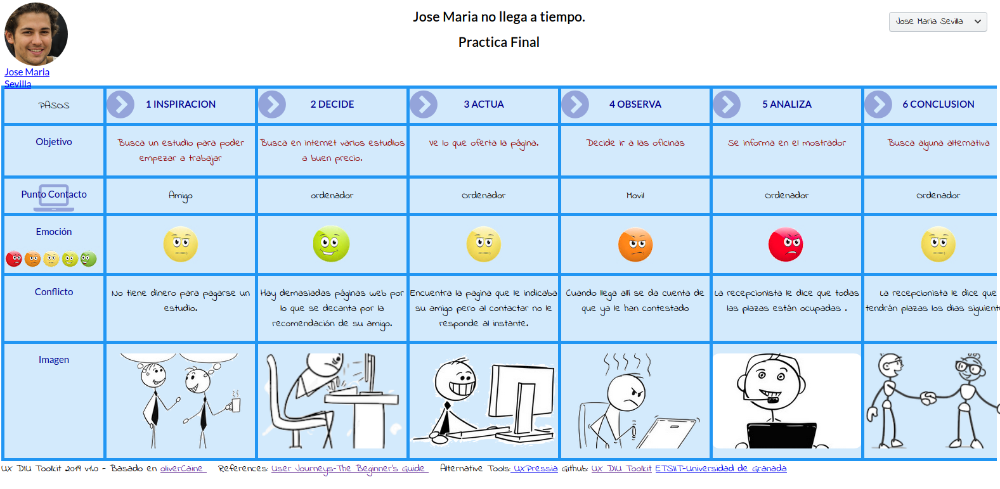
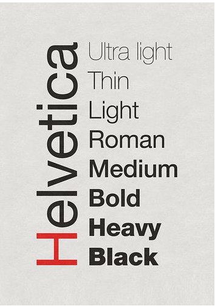
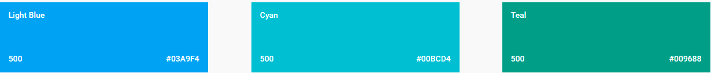

# DIU20
Teoría de Diseño Interfaces de Usuario 2019-20 (Coworking)

Curso: 2019/20

Proyecto:Teamwork.

Descripción:Teamwork es una una aplicación móvil a desarrollar que te permite encontrar un espacio de trabajo donde puedas desarrollar tu actividad.La idea es que el usuario(ya sea autónomo,emprendedores,profesionales,freelance) tenga la máxima libertad de elegir donde quiere desarrollar su actividad sin tener el problema de estar estático por un tiempo y tenga la movilidad que quiera que busque.El usuario tendrá también la posibilidad de ver en tiempo real que tipo de ambiente ,de profesionales para poder estar rodeado de profesionales con diferentes capacidades, intereses y redes de contactos.Las oficinas o lugar(la idea es que no tiene por que ser una oficina)podrá poner sus normas con toda la libertad y de la forma más dinámica.

Las ideas vamos a diseñar o redefinir de las páginas anteriores:

    -Tiempo real de la disponibilidad de las oficinas .

    -Buscar una mayor interacción entre los profesionales haciendo uso de herramientas de chat,correo,etc.

    -Promociones que sean establecidas por los lugares de trabajo .

    -Un monedero para llevar un control de tus gastos.

Logotipo:

Miembros
 * :bust_in_silhouette:   https://github.com/salva12345678/DIU     :octocat:        
-----

En esta practica teórica estudiaremos el concepto de coworking realizaremos una propuesta para su diseño Web/movil. Utilizaremos herramientas y entregables descritos en el siguiente CheckList (https://github.com/mgea/UX-DIU-Checklist)

Qué es el concepto de **Coworking**: http://www.comunidadcoworking.es/que-es-coworking/

# Proceso de Diseño

## Paso 1. UX Desk Research & Analisis

 1.a Competitive Analysis
-----

>>> Entre las páginas web que hemos visto o que se nos ha proporcionado son  [ErrantT](https://www.errant.es/contacto/) y [Cubikate](https://cubikate.es/).

Tabla de comparativas:

|EMPRESAS                                | ErrantT         | Cubikate
| :------:                               | :------:        | :------: |  
| Lista de precios                     | SI              |  NO      |       
| Más de un idioma                    | SI              |  NO      |     
| web                                    | SI              |  SI      |
| Android                        | NO              |  NO      |
| iOS                            | NO              |  NO      |
| Blog                           | SI              |  NO      |
| Características básicas de la oficina                   |     SI            |    NO      |   
| Vídeo promocional                        |   SI             |     NO            |

Entre estas dos se ha elegido [ErrantT](https://www.errant.es/contacto/) dado que tiene mayor número de características integradas y nos puede ayudar para partir del diseño.

 1.b Persona
-----

>>>En primer lugar hemos creado a [Jose María](https://github.com/salva12345678/DIU/tree/master/P1),Una persona con amplias capacidades pero con pocos recursos.Tiene los parámetros perfectos para poder usar la página web.

 1.c User Journey Map
----

>>> **Jose Maria no llega a tiempo**.Aquí se nos presenta el problema de la disponibilidad de las oficinas.

 1.d Usability Review
----

>>> - Enlace al documento:
      Para ver el PDF [pulse aquí](https://github.com/salva12345678/DIU/blob/master/P1/Usability-review.pdf)

>>> - Valoración final de **ErrantT**:69
>>> - Comentario sobre la valoración:En general la web cumple con las principales características y metas que se persiguen.La información que se muestra es precisa y no es redundante.Los resultados de las búsquedas pues se podría mejorar.El rendimiento de la página es excelente.Existen otros aspectos que no han sido muy gratificantes como la falta de funcionalidades de la página que es el mayor de los problemas que le veo.Una cosa que no se lo he visto al resto de empresas que compiten es que dicen ya los precios.

## Paso 2.Incontro UX Design

 2.a Feedback Capture Grid
----

En la malla receptora de información que hemos recopilado teniendo en cuenta las buenas características de la web que analizamos en la practica 1,las dificultades que encontraron nuestros usuarios que gracias a ese punto de vista vimos que podían mejorarse y algunas sugerencias para implementar nuevas funcionalidades,llevar a cabo una crítica constructiva centrándonos en los errores críticos que hemos analizado e ideas aportadas por los desarrolladores donde se corregirían funcionalidades y aportar propuestas de valor como una función en tiempo real de la disponibilidad de las oficinas para que el usuario sepa al instante si debe acudir a esa oficina o una mayor interacción entre los profesionales y los clientes.    

- Feedback Capture Grid: Malla Receptora De Información.

  | Interesante                                                          | Críticas                                          |
  | :------:                                                             | :------:                                          |
  | 1.Información precisa y concisa.                                     | 1.Falta de idiomas.                               |       
  | 2.Tarifas y precios establecidos.                                    | 2.Ofrece poco contenido                           |      
  | 3.Disponibilidad de un blog .                                        | 3.Falta de ayuda y un formulario.                 |
  | 4.Videos promocionales                                .              | 4.Mantener la coherencia del idioma.              |
  |  __Preguntas__                                                       |  __Nuevas ideas__                                 |
  | 1.Crear grupos en función del tipo de autónomo.                       | 1.Funcionalidades adaptadas al tipo de usuario.   |
  | 2.Poner claro donde está el servicio técnico.                        | 2.Funcionalidades para una mayor libertad del establecimiento                |        
  | 3.Un chat de los asistentes a esa oficina.                             | 3. herramientas de chat,correo,etc         |
  | 4.El chat más amplio en cuestión de temas                               | 4.Tiempo real de la disponibilidad de las oficinas.                                   |
  | 5.Realidad aumentada en caso de tener que hacer una reunión en la oficina.                   | 5.Un monedero para el saldo..  |    
  | 6.Me gustaría un modo privado.                                      | 6.Un tutorial guiado.                             |
  | 7.Un modo nocturno nocturno.                                         |                       |

 2.b Tasks & Sitemap
-----

Entre las dos posibilidades nos hemos decidido por por hacer la matriz de tareas para analizar los usuarios que van a usar la aplicación y las tareas principales para poder analizar la frecuencia de uso de las acciones y así poder situar las funcionalidades en la aplicación. Para todo esto se hará un ranking de estas funcionalidades pero también viendo otros aspectos ya que habrá algunas funcionalidades que solo usará uno de los tantos tipos de usuarios que hay.

|GRUPOS DE USUARIOS              | Usuario         | Establecimientos   | Usuarios no registrados  | Ranking  |
| :------:                       | :------:        | :------:           |  :------:                | :------: |
| Buscar.                        | Alto            | Alto               | NO                       | 10       |
| Consultar Correo.              | Medio-Alto      | Alto               | NO                       | 10       |
| Consultar chat.                | Alto            | Bajo               | NO                       | 10       |
| Consultar oferta.              | Medio           | Alto               | NO                       | 10       |
| Enviar Correo.                 | Bajo            | Alto               | NO                       | 8        |
| Consultar Notificaciones.      | Medio           | Medio              | NO                       | 8        |
| Abonar Dinero.                 | Medio           | Alto               | NO                       | 7.5      |
| Consultar calendario.          | Medio           | Bajo               | NO                       | 7        |
| Asistir Oficina.               | Alto            | NO                 | NO                       | 6        |
| Alta en Oficina.               | Medio-Alto      | NO                 | NO                       | 5        |
| Crear Oficina.                 | Bajo            | Bajo               | NO                       | 5        |
| Pasar a privado.               | Bajo            | Bajo               | NO                       | 4        |
| Cambiar idioma.                | Bajo            | Bajo               | NO                       | 4        |
| Poner modo nocturno.           | Bajo            | Bajo               | NO                       | 4        |
| Consultar dinero.              | Bajo            | Bajo               | NO                       | 4        |
| Poner Oferta.                  | NO              | Medio              | NO                       | 4        |
| Consultar ayuda.               | Bajo            | Bajo               | NO                       | 4        |
| Iniciar Sesión.                | Bajo            | Bajo               | NO                       | 3        |
| Baja de oficina.               | Bajo            | NO                 | NO                       | 2        |
| Quitar oferta.                 | NO              | Bajo               | NO                       | 2        |
| Borrar Oficina.                | NO              | Bajo               | NO                       | 1        |   
| Validar Oficina.               | NO              | Bajo               | NO                       | 1        |
| Registrarse.                   | NO              | NO                 | Bajo                     | 1        |
| Introducir credenciales.       | NO              | NO                 | Bajo                     | 1        |

 2.c Labelling
----

Dado el tiempo dado para el desarrollo de la practica final no he podido llevar a cabo el Labelling.

 2.d Wireframes
-----

Esta aplicación se ha diseñado de tal forma que se pueda llevar a cabo su implementación tanto en android o ios.En el caso que se llevara el desarrollo de los bocetos se centraría en la experiencia de usuario para poder visualizar las nuevas mecánicas y funcionalidades de la aplicación.

  3.b Logotipo

El logotipo final para este proyecto se ha elegido el siguiente:

 3.c Guidelines

Se trata de buscar elementos que facilitan legibilidad de la aplicación de forma que repercuten de forma positiva sobre nuestra aplicación de cara a los usuarios.
Se busca el uso de 2 o 3 colores que definan a la aplicación y sus valores de la marca y bien estructurados.además de los colores será necesario un tipo de tipografía adecuada.

tipografía usada:Helvética.

Colores usados:

Para más información [pulse aquí](https://github.com/salva12345678/DIU/tree/master/P3)

##   3.e Conclusión final.

Como conclusión final de un segundo trabajo he podido percibir que he podido analizar de otra forma la página para la cual hemos rediseñado en un tiempo récord además de poder encontrar nuevas ideas de negocio que podrían ayudar a todos los usuarios e ir más allá ya que la aplicación tienen cabida no sola una oficina sino cientas de ellas o que cualquiera que tenga un espacio y los recursos mínimos también puede tomar parte de la aplicación.
