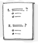

# DIU20
Teoría de Diseño Interfaces de Usuario 2019-20 (Coworking)

Curso: 2019/20

Proyecto:Teamwork.

Descripción:Teamwork es una una aplicación móvil a desarrollar que te permite encontrar un espacio de trabajo donde puedas desarrollar tu actividad.La idea es que el usuario(ya sea autónomo,emprendedores,profesionales,freelance) tenga la máxima libertad de elegir donde quiere desarrollar su actividad sin tener el problema de estar estático por un tiempo y tenga la movilidad que quiera que busque.El usuario tendrá también la posibilidad de ver en tiempo real que tipo de ambiente ,de profesionales para poder estar rodeado de profesionales con diferentes capacidades, intereses y redes de contactos.Las oficinas o lugar(la idea es que no tiene por que ser una oficina)podrá poner sus normas con toda la libertad y de la forma más dinámica.

Las ideas vamos a diseñar o redefinir de las páginas anteriores:

    -Tiempo real de la disponibilidad de las oficinas .

    -Buscar una mayor interacción entre los profesionales haciendo uso de herramientas de chat,correo,etc.

    -Promociones que sean establecidas por los lugares de trabajo .

    -Un monedero para llevar un control de tus gastos.

Logotipo:

Miembros
 * :bust_in_silhouette:   https://github.com/salva12345678/DIU     :octocat:        
-----

En esta practica teórica estudiaremos el concepto de coworking realizaremos una propuesta para su diseño Web/movil. Utilizaremos herramientas y entregables descritos en el siguiente CheckList (https://github.com/mgea/UX-DIU-Checklist)

Qué es el concepto de **Coworking**: http://www.comunidadcoworking.es/que-es-coworking/

# Proceso de Diseño

## Paso 1. UX Desk Research & Analisis

 1.a Competitive Analysis
-----

>>> Entre las páginas web que hemos visto o que se nos ha proporcionado son  [ErrantT](https://www.errant.es/contacto/) y [Cubikate](https://cubikate.es/).

Tabla de comparativas:

|EMPRESAS                                | ErrantT         | Cubikate
| :------:                               | :------:        | :------: |  
| Lista de precios                     | SI              |  NO      |       
| Más de un idioma                    | SI              |  NO      |     
| web                                    | SI              |  SI      |
| Android                        | NO              |  NO      |
| iOS                            | NO              |  NO      |
| Blog                           | SI              |  NO      |
| Características básicas de la oficina                   |     SI            |    NO      |   
| Vídeo promocional                        |   SI             |     NO            |

Entre estas dos se ha elegido [ErrantT](https://www.errant.es/contacto/) dado que tiene mayor número de características integradas y nos puede ayudar para partir del diseño.

 1.b Persona
-----

>>>En primer lugar hemos creado a [Jose María](https://github.com/salva12345678/DIU/tree/master/P1),Una persona con amplias capacidades pero con pocos recursos.Tiene los parámetros perfectos para poder usar la página web.

 1.c User Journey Map
----

>>> [El problema de Manuel con el ingles](https://github.com/salva12345678/DIU/tree/master/P1).Aquí se nos presenta el problema de la dificultad de cambiar de idioma.

>>> [Encuentro por sorpresa de Noelia con su ex](https://github.com/salva12345678/DIU/tree/master/P1).Aquí se nos presenta el problema de tener tu cuenta en modo público.

 1.d Usability Review
----

>>> - Enlace al documento:
      Para ver el PDF [pulse aquí](https://github.com/salva12345678/DIU/blob/master/P1/Usability-review.pdf)

>>> - Valoración final de Meetup:64
>>> - Comentario sobre la valoración:En general la web cumple con las principales características y metas que se persiguen.La información que se muestra es precisa y no es redundante.Los resultados de las búsquedas son relevante y precisas.El rendimiento de la página es excelente.Existen otros aspectos que no han sido muy gratificantes.Las funciones de volver atrás fallaban y te llevaba a una pantalla en blanco.En la página hay marcadores que están descuadrados.La ubicación actual no está clara .La búsqueda por parámetros múltiples es bastante pobre.No hay búsquedas comunes sino que ya están definidas.Los usuarios no pueden enviar comentario,no hay correo de la empresa y solo hay un chat de ayuda.

Para más información [pulse aquí](https://github.com/salva12345678/DIU/tree/master/P1)

## Paso 2.Incontro UX Design

 2.a Feedback Capture Grid
----

En la malla receptora de información que hemos recopilado teniendo en cuenta las buenas características de la web que analizamos en la practica 1,las dificultades que encontraron nuestros usuarios que gracias a ese punto de vista vimos que podían mejorarse y algunas sugerencias para implementar nuevas funcionalidades,llevar a cabo una crítica constructiva centrándonos en los errores críticos que hemos analizado e ideas aportadas por los desarrolladores donde se corregirían funcionalidades y aportar propuestas de valor como es el sistema de bonificación por la asistencia de los eventos en el ámbito de los idiomas ademas de buscar una simbiosis entre los tres protagonistas principales como el usuario,el profesional y el establecimiento para que se beneficien y cooperen.    

Para ver la malla receptora de información [pulse aquí](https://github.com/salva12345678/DIU/tree/master/P2)

 2.b Tasks & Sitemap
-----

Entre las dos posibilidades nos hemos decidido por por hacer la matriz de tareas para analizar los usuarios que van a usar la aplicación y las tareas principales para poder analizar la frecuencia de uso de las acciones y así poder situar las funcionalidades en la aplicación. Para todo esto se hará un ranking de estas funcionalidades pero también viendo otros aspectos ya que habrá algunas funcionalidades que solo usará uno de los tantos tipos de usuarios que hay.

Para ver la matriz de usuario y tareas [pulse aquí](https://github.com/salva12345678/DIU/tree/master/P2)

 2.c Labelling
----

Para una mayor comodidad se ha creado una jerarquía principal para tener una vista principal y  luego poder analizar cada sector por separado.

Para ver los diagramas y su correspondiente explicación [pulse aquí](https://github.com/salva12345678/DIU/tree/master/P2)

 2.d Wireframes
-----

Para esta parte hemos desarrollado una serie de bocetos sobre las distintas partes de la interfaz.Para tener una mayor organización y podamos entender el flujo que sigue se hará un diagrama de flujo de los bocetos.Esta aplicación se ha diseñado de tal forma que se pueda llevar a cabo su implementación tanto en android o ios.

Para ver los bocetos de la interfaz [pulse aquí](https://github.com/salva12345678/DIU/tree/master/P2)

## Paso 3. Mi equipo UX-Case Study

 3.a ¿Como se cuenta un UX-Case Study?
-----

Es una aplicación cuyo objetivo es acercar a los artistas al público ofreciendo información sobre ellos y sus obras.En esta parte hacemos una reflexión de los aspectos más importantes que hemos visto en en el desarrollo de [MuseMap](https://blog.prototypr.io/musemap-street-art-app-ux-case-study-9bec6a99823b) como la idea de hacer encuestas y posteriormente hacer entrevistas y demás ideas originales.

Para ver la reflexión [pulse aquí](https://github.com/salva12345678/DIU/tree/master/P3)

##   3.b Logotipo

El logotipo final para este proyecto se ha elegido el siguiente:

Para más información [pulse aquí](https://github.com/salva12345678/DIU/tree/master/P3)

##  3.c Guidelines

Se trata de elementos que facilitan la usabilidad y legibilidad de la app y si están bien empleados repercutirán de forma positiva sobre nuestra app de cara al usuario.
El color debe usarse con moderación y seguir una lógica. Una app llena de colores sin jerarquía, no tendrá el mismo efecto que una app con 2-3 colores que definen los valores de la marca y bien estructurados. Podríamos decir lo mismo de la elección tipográfica, no podemos esperar que la app atraiga a usuarios teniendo una sola tipografía sin diferenciar los títulos del texto, ni usando 3 tipografías antagónicas, ya que acabarían dificultando la lectura, lo que hará que el usuario ya no quiera usar la app o quiera eliminarla.

Para más información [pulse aquí](https://github.com/salva12345678/DIU/tree/master/P3)

##   3.d Video

Para más información [pulse aquí](https://github.com/salva12345678/DIU/tree/master/P3)

##   3.e Conclusión final.

Reflexión de como nos ha influido positivamente las practicas y que nos ha ayudado a tener otra perspectiva sobre la experiencia de usuario.

Para más información [pulse aquí](https://github.com/salva12345678/DIU/tree/master/P3)

## Paso 4. Evaluación

Los casos que se nos han asignado son los siguientes.

|  Grupo de DIU | Grupo Asignado   | Link para ver su GitHub                               |  
|  ------------ | -------          | -------                                               |
|  DIU1         | MMM              | [pulse aquí](https://github.com/patchispatch/DIU20)   |         
|  DIU2         | Mumavi           | [pulse aquí](https://github.com/javiercdag/DIU20)     |                
|  DIU3         | Lutece           | [pulse aquí](https://github.com/IvanitiX/DIU20)       |                 

Para ver la valoración [pulse aquí](https://github.com/salva12345678/DIU/tree/master/P4)

 4.b User Testing
----

1.En **Nomadizers, Noelia** ha encontrado un problema en la no existencia de métodos de pago.

2.En **FHome, Noelia** ha encontrado un problema en el que aquellas personas que solo quieren ofertar un habitación.

3.En **CountWithMe, Manuel** encuentra un problema que le hace no asistir a un evento por falta de un recordatorio o calendario.

Para ver las historias propuestas [pulse aquí](https://github.com/salva12345678/DIU/tree/master/P4)

. 4.c Ranking
----

|Posición|  Grupo de DIU | Grupo Asignado   | Puntuación   |  
|-----   |  ------------ | -------          | -------      |
|1       |  DIU2         | Mumavi           | 70           |
|2       |  DIU3         | Lutece           | 65           |
|3       |  DIU1         | MMM              | 56           |   

En general,los site map no siguen una estructura de cabeza ,cuerpo y pie para la aparición de las distintas funcionalidades,dichas funcionalidades aparecen incompletas, mal detallas .La Tasks matrix no concuerdan con lo aparecido en el site map  además de no aparecer las ideas destacadas .No se diferencian los roles de usuario.Los bocetos en general son bastante lo que tendrían el aspecto final.Los personajes deberían desarrollar más.No dan ideas de negocio en sus aplicaciones.

Para ver la valoración personal [pulse aquí](https://github.com/salva12345678/DIU/tree/master/P4)
